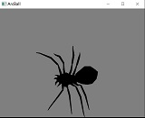
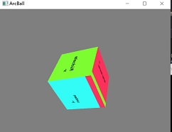
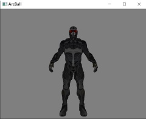
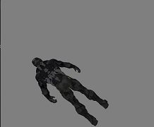
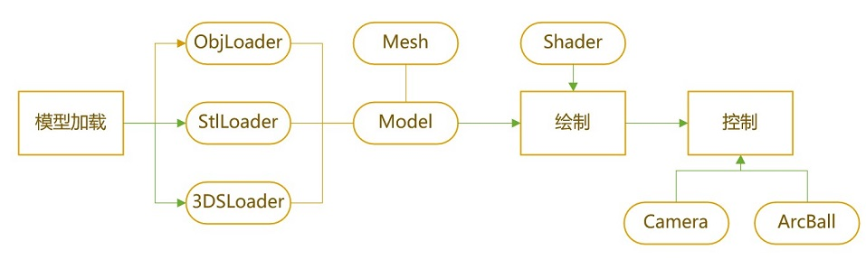
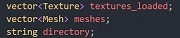
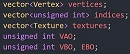
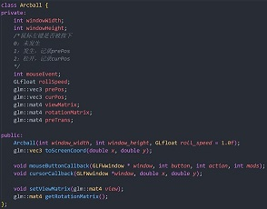
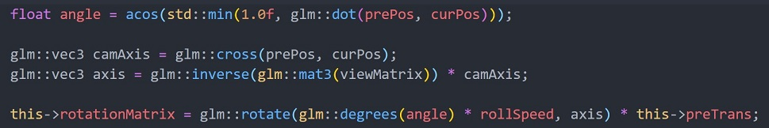

# <center>Arcball系统 </center>

<center>人工智能学院 牛李金梁 201928014629008</center>

## 实验目的
- 熟悉常用三维模型文件格式，编程实现三维模型的解析
- 熟悉OpenGL的基本绘制框架，并编程实现三维模型的绘制
- 熟悉基于Arcball旋转控制原理，并对其进行编程实现

## 系统功能概述
首先要从3维模型文件（如obj、stl、3DS）中读取网格数据，之后对其进行基本的绘制，然后对该模型可以采用arcball方法进行控制，并实现平移、缩放、旋转等控制。

## 功能展示

#### 运行提示
打开demo文件夹，在命令行中键入
```
arcBall.exe samples/nanosuit/nanosuit.obj
```
即可测试。

#### stl文件读取与绘制


stl格式不含材质信息

#### 3ds文件读取与绘制


#### obj文件读取与绘制


#### 调整模型


## 系统设计

#### 整体框架


### 依赖库：

OpenGL相关：Glad、GLFW

数学库：glm

贴图：stb_image.h

#### 模型读取模块
对应ObjLoader、StlLoader、3DSLoader、Mesh、Model这几个类。

XXXLoader类作用是给一个路径，读取模型文件。是从网络上找的资源，并对其中进行改造，如使用glm库替代，使用统一的顶点类Vertex和材质类Texture。

3维模型读取后统一实例化一个Model类，其数据成员为：



分别代表材质、网格和所在路径。

Model还提供函数Draw()，对每一个网格进行绘制。

Mesh类数据成员为：



即网格的点集、索引集以及材质集，以及绘制所用的VAO、VBO和EBO。

Mesh还提供绘制函数Draw()，绑定纹理后利用VAO绘制。

#### 绘制模块
对应Shader和main函数中的一些设置。

对于每个网格，在已经知道其顶点位置、三角形索引以及材质后,使用OpenGL可编程渲染管线，利用GLSL编写简单的着色器。顶点着色器vertex.glsl中为MVP坐标变换。片段着色器fragment.glsl中为贴图着色，并未给予光照模型。

#### 控制模块
对应Camera、Arcball。

Camera指明了相机的相关信息，Arcball则提供了在平面上控制3维模型旋转的可能。

对于平移和缩放功能，对Camera进行变换更加方便。

旋转则利用Arcball。

#### arcball
arcball是在2维平面内控制模型旋转的方法。

其主要逻辑为：

1.将显示器平面坐标投影到arcball的半球平面上。

2.利用鼠标按下和拖动后的位置计算旋转角度和旋转轴。

3.记录每一次旋转后的模型，防止每一次鼠标点击后重置。



其中，windowWidth和windowHeight是opengl窗口决定的参数。

函数toScreenCoord()是将平面坐标变换到arcball上，需注意的是本程序未利用Camera信息变换到世界坐标系，而是保留相机坐标系中的坐标，处理在后边函数中。

prePos和curPos是鼠标拖拽前后在arcball上的坐标。
mouseEvent对应的是鼠标左键被按下的情况。

viewMatrix记录的是view矩阵，通过setViewMatrix()由主程序设置。rotationMatrix记录的是旋转矩阵，是最终arcball提供给主程序的旋转变换。

mouseButtonCallback()和cursorCallback()是给主程序的回调函数。

当鼠标左键按下时，mouseEvent由0变成1，记录下此时坐标作为prePos，然后mouseEvent由1变成2，在拖拽鼠标的过程中curPos不断改变，并在下面语句中计算旋转矩阵，注意利用了反向view变换将坐标从摄像机坐标系转变到世界坐标系。



对于记录每一次旋转后的模型，可以在mouseEvent由0变成1时记录rotationMatrix，然后再mouseEvent由1变成2时乘上这个矩阵。

在主程序中，arcball对应的是model变换。
